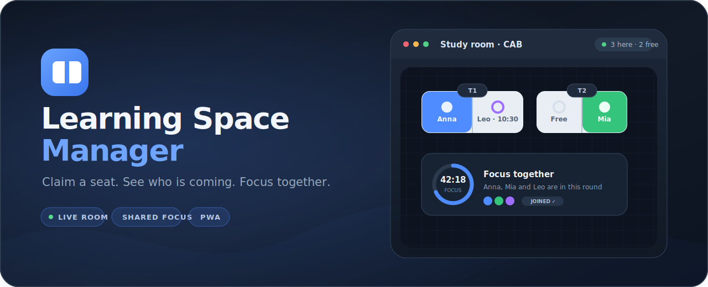
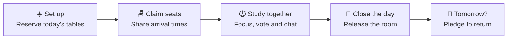
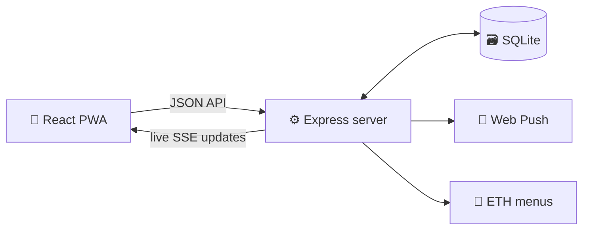

<div align="center">
  

  <br />

  <a href="https://github.com/michaelmrusch/lsm/actions/workflows/docker.yml">
    
  </a>
  
  
  
  
  
  <a href="https://github.com/michaelmrusch/lsm/commits/main">
    
  </a>

  <p>
    <strong>A tiny, mobile-first app for coordinating shared study tables at university.</strong><br />
    Know who is coming, where everyone is sitting, and when it is time to focus.
  </p>

  <p>
    <a href="#highlights">Highlights</a> ·
    <a href="#quick-start">Quick start</a> ·
    <a href="#docker-deployment">Docker</a> ·
    <a href="#architecture">Architecture</a> ·
    <a href="#api-reference">API</a>
  </p>
</div>

## ✨ Why LSM?

Group study coordination usually gets scattered across chat messages:

> “Who is there?” · “Is there still a seat?” · “When are you coming?” · “Are we focusing now?”

Learning Space Manager turns that noise into one live room. A **space** is a persistent study group with a stable six-character code. Each day, the first person on site opens the room, reserves tables, and lets everyone else claim a seat with an ETA.



<a id="highlights"></a>

## 🌟 Highlights

<table>
  <tr>
    <td width="50%" valign="top">
      <h3>🗺️ A room that updates live</h3>
      Every phone sees the same top-down table map, occupied seats, arrival status, ETAs, free capacity, votes, timers, and chat through Server-Sent Events.
    </td>
    <td width="50%" valign="top">
      <h3>🪑 Fast seat coordination</h3>
      Claim a precise seat, move between tables, reserve for a guest, mark yourself arrived, or release the spot when you leave.
    </td>
  </tr>
  <tr>
    <td width="50%" valign="top">
      <h3>🧩 Collaborative table setup</h3>
      Add or remove tables together, change their capacity, drag them around the room, and rotate them without moving people who are already seated.
    </td>
    <td width="50%" valign="top">
      <h3>⏱️ Focus together</h3>
      Start a shared 45, 60, 90, custom-minute round — or one that ends at a set time, so breaks can be planned. Others can join during the opening window and every participant gets the break alert.
    </td>
  </tr>
  <tr>
    <td width="50%" valign="top">
      <h3>📲 Installable and notification-ready</h3>
      LSM is a mobile-first PWA with Web Push for morning setup, room activity, votes, focus timers, and chat. Light and dark themes follow your device, or pick one yourself.
    </td>
    <td width="50%" valign="top">
      <h3>🥙 Decisions without chat chaos</h3>
      Run live polls or launch the ETH Zentrum lunch vote with current menus, dish previews, suggestions, and a reminder for non-voters.
    </td>
  </tr>
  <tr>
    <td width="50%" valign="top">
      <h3>💬 A room-sized chat</h3>
      Keep day-specific coordination out of the big WhatsApp group. The chat disappears with the session and can be muted whenever the room needs quiet.
    </td>
    <td width="50%" valign="top">
      <h3>🔐 Invite-only small groups</h3>
      Persistent space codes, one-time registration invites, and an admin overview keep access and moderation simple.
    </td>
  </tr>
</table>

<details>
<summary><strong>More feature details</strong></summary>

### Room and tables

- Tables are draggable, rotatable in 90° steps, and adjustable from one to eight seats.
- The room automatically frames the occupied layout while keeping space around the edges.
- Seats use solid colors for people who are present and outlined colors for people who are coming; free seats are outlined and labelled.
- Labels choose the fullest name that fits without shrinking the font, and add the arrival time underneath when the seat is big enough to hold it.
- Empty tables can be returned, reclaimed, or marked as taken by people outside the group.
- A session automatically expires after 28 hours, while its group and members remain available.

### Groups and people

- Accounts use a name, four-to-eight-digit PIN, and personal color.
- New registrations require a one-time admin invite; the first account and `ADMIN_USERNAME` can bootstrap access.
- Space codes and share links are permanent, even though the daily room is reset.
- The home screen shows people counts and free-seat availability for every active space.
- Tomorrow pledges give the next opener an early estimate of how many seats will be needed.
- Admins can book a seat in another member's name, or reserve for a guest attributed to any member.
- Colors are unique within a space: if yours is already taken when you join, you're given a random free one just for that space.

### Collaboration

- Poll options can be added by the group and ballots can be changed or withdrawn.
- Lunch votes include ETH Zentrum menus, closures, dish photos, and limited user suggestions.
- Shared focus rounds display every participant and send a single break notification when time is up.
- Session chat is readable by the space and writable by people holding a seat that day.

</details>

<a id="quick-start"></a>

## 🚀 Quick start

### Requirements

- [Node.js 24](https://nodejs.org/) recommended
- npm

```bash
git clone https://github.com/michaelmrusch/lsm.git
cd lsm

npm install
npm --prefix web install
npm run dev
```

Open [http://localhost:5173](http://localhost:5173). The API runs on `http://localhost:3000`, and SQLite is created automatically at `data/lsm.sqlite`.

### Useful commands

| Command | Purpose |
|---|---|
| `npm run dev` | Run Express and Vite together with live reload |
| `npm run build` | Type-check and build the production frontend |
| `npm start` | Start Express and serve the frontend produced by `npm run build` |

<a id="docker-deployment"></a>

## 🐳 Docker deployment

The included Compose file runs the prebuilt image and persists all application data under `./data`.

```bash
git clone https://github.com/michaelmrusch/lsm.git
cd lsm
docker compose up -d
```

Every push to `main` builds `ghcr.io/michaelmrusch/lsm` with GitHub Actions and the repository's built-in token. Images are tagged both `latest` and with the commit SHA for easy rollbacks.

To update an existing installation:

```bash
docker compose up -d
```

`pull_policy: always` fetches the newest image before recreating the service.

<details>
<summary><strong>Public access with Cloudflare Tunnel</strong></summary>

Point a Cloudflare Zero Trust tunnel at `http://localhost:3000`; Cloudflare can terminate HTTPS without a separate reverse proxy or certificate setup.

When `cloudflared` runs on the same machine, change the published port in `docker-compose.yml` to:

```yaml
ports:
  - "127.0.0.1:3000:3000"
```

That keeps the app reachable through the tunnel without exposing port `3000` publicly.

</details>

### Configuration

| Setting | Default | Description |
|---|---:|---|
| `PORT` | `3000` | Express HTTP port |
| `DATA_DIR` | `./data` | SQLite database and generated VAPID keys |
| `ADMIN_USERNAME` | — | Grants the matching account access to `/admin` |
| `NAME_BLOCKLIST_FILE` | — | Optional absolute path to an extra name-policy JSON file; changes are picked up automatically |

### Name policy

New account names and guest reservations use the same case-insensitive name
policy. It normalizes punctuation, spacing, accents, common Unicode lookalikes
and leetspeak before checking a maintained English profanity dataset and the
local list in `server/name-blocklist.json`.

To add deployment-specific entries without rebuilding the image, set
`NAME_BLOCKLIST_FILE` to a mounted JSON file. It may contain any of these
optional arrays:

```json
{
  "blockedTerms": ["word blocked even inside a longer name"],
  "blockedNames": ["exact full name"],
  "allowedProfanityTerms": ["legitimate name exception"]
}
```

The external entries extend the built-in list and are reloaded when the file
changes. Existing accounts can still sign in after policy updates; the policy
applies when registering a new account or reserving a new guest.

<a id="architecture"></a>

## 🏗️ Architecture



| Layer | Technology | Role |
|---|---|---|
| Frontend | React 18, TypeScript, Vite | Mobile-first installable PWA, light/dark themed from CSS custom properties |
| Backend | Node.js 24, Express | Authentication, room logic, API and static hosting |
| Database | SQLite, `better-sqlite3` | Single-file persistence with foreign keys |
| Realtime | Server-Sent Events | Live room refreshes |
| Notifications | Web Push, service worker | Mobile alerts for room activity and collaboration |
| Deployment | Multi-stage Docker, Compose | Small production image and persistent data volume |

```text
lsm/
├── server/                 # Express routes, SQLite schema and background jobs
├── web/
│   ├── src/                # React pages, components and PWA client logic
│   └── public/             # Manifest, service worker and app icons
├── scripts/                # Repository utilities
├── .github/workflows/      # Container build and publish workflow
├── docker-compose.yml
└── Dockerfile
```

<a id="api-reference"></a>

## 🔌 API reference

<details>
<summary><strong>Authentication, spaces, seats, collaboration, and admin endpoints</strong></summary>

### Authentication and dashboard

```text
POST   /api/auth/session                       Register or sign in
POST   /api/auth/logout                        End the current session
GET    /api/auth/me                            Read the signed-in account
GET    /api/me/spaces                          List the user's spaces with current stats
GET    /api/me/events                          SSE refresh stream for the home dashboard
```

### Spaces and sessions

```text
POST   /api/spaces                             Create a group and first session
GET    /api/spaces/:code                       Read live state and join the group
GET    /api/spaces/:code/events                Space SSE stream
POST   /api/spaces/:code/sessions              Set up today's room
PATCH  /api/spaces/:code                       End today's session
DELETE /api/spaces/:code                       Permanently delete the group
POST   /api/spaces/:code/tomorrow              Pledge to return tomorrow
DELETE /api/spaces/:code/tomorrow              Withdraw tomorrow's pledge
GET    /api/spaces/:code/membership            Read your archive + notification settings
PATCH  /api/spaces/:code/membership            Update archive flag or notification switches
DELETE /api/spaces/:code/membership            Leave the space (non-owner, no active seat)
PATCH  /api/spaces/:code/settings              Rename or transfer ownership (owner/admin)
```

### Tables and seats

```text
POST   /api/spaces/:code/tables                Add a table
PATCH  /api/spaces/:code/tables/:id            Move, rotate, resize or release a table
DELETE /api/spaces/:code/tables/:id            Remove an empty table
POST   /api/spaces/:code/tables/:id/claims     Claim or move to a seat
POST   /api/spaces/:code/tables/:id/guests     Reserve a guest seat
PATCH  /api/spaces/:code/claims/:id            Update ETA or mark arrived
DELETE /api/spaces/:code/claims/:id            Release a seat
```

### Votes, timers, chat, and menus

```text
POST   /api/spaces/:code/votes                 Start a regular or lunch vote
DELETE /api/spaces/:code/votes/:id             Remove a vote
POST   /api/spaces/:code/votes/:id/options     Add an option
POST   /api/spaces/:code/votes/:id/ballots     Cast, change or retract a ballot
POST   /api/spaces/:code/timers                Start a shared focus round
POST   /api/spaces/:code/timers/:id/join       Join a focus round
DELETE /api/spaces/:code/timers/:id/join       Leave a focus round
DELETE /api/spaces/:code/timers/:id            Stop or dismiss a focus round
POST   /api/spaces/:code/chat                  Send a room message
POST   /api/spaces/:code/chat/mute             Toggle chat push notifications (mirrors Settings)
GET    /api/menus                              Read today's cached menus
```

### Administration and push

```text
GET    /api/admin/overview                     Read users, spaces, and invite codes
POST   /api/admin/invites                      Generate a one-time invite
DELETE /api/admin/invites/:code                Revoke an unused invite
DELETE /api/admin/users/:id                    Delete a non-admin account
GET    /api/push/key                           Read the VAPID public key
POST   /api/push/subscribe                     Save a push subscription
POST   /api/push/unsubscribe                   Remove a push subscription
```

</details>

## ✅ Verification

Build the production frontend before shipping a change:

```bash
npm run build
```

The production build type-checks the React frontend and emits the static bundle consumed by Express and the Docker image.

<div align="center">
  <br />
  <strong>Less coordination. More studying. 🪑</strong>
</div>
